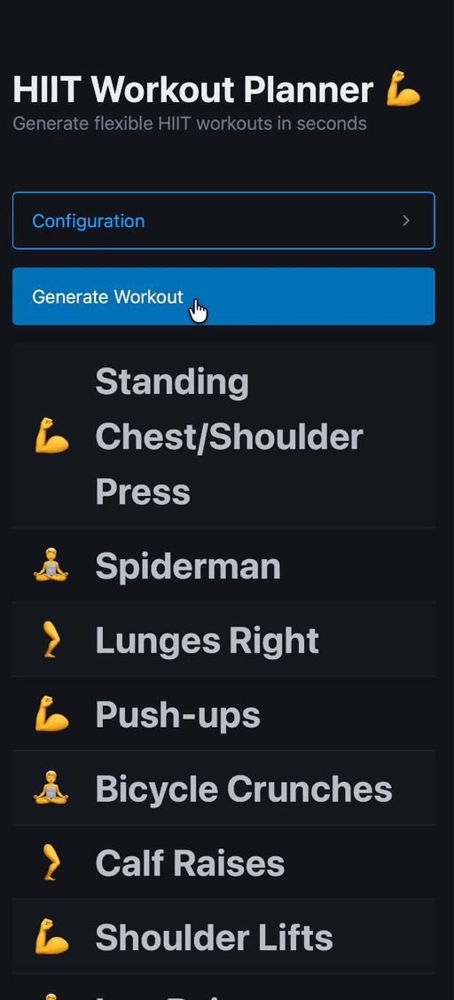
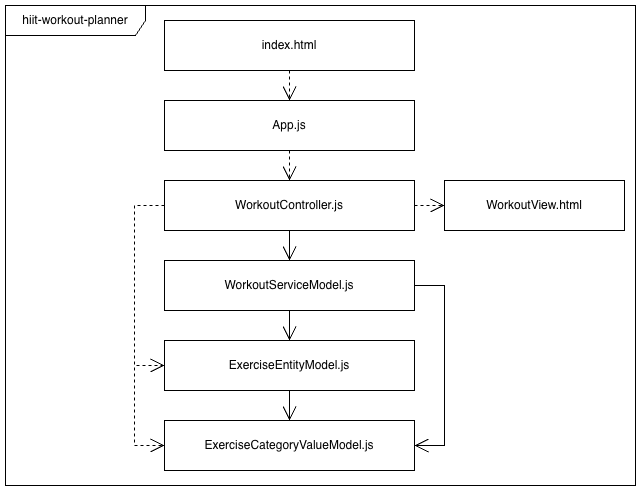

# HIIT Workout Planner 💪

Generate flexible HIIT workouts in seconds.

Try the [live version](https://tim-fuchs.github.io/hiit-workout-planner/ "Live Version") and generate a high-intensity interval training with just one click.

## Features

- Create workouts tailored to your focus areas:
  - 💪 Chest + Arms
  - 🧘 Abs
  - 🦵 Legs
- Set exactly how many rounds you want to train
- Control how often the category changes
- Generate a fresh randomized workout every time

## Tech Stack

- HTML, CSS, and JavaScript
- [Pico](https://picocss.com "Pico website") for lightweight styling
- GitHub Pages for deployment

## Project Structure

The project structure follows the classic Model-View-Controller pattern:

## Run Locally

1. Clone the repository.
2. Open `index.html` in your web browser.

## Testing

### Local

The unit tests for the model files are located in the [tests](/tests/) folder.

Steps:

1. Install dependencies: `npm ci`
2. Run the tests and create code coverage report: `npm run test:coverage` (created via [c8](https://github.com/bcoe/c8))

### Deployed

For pull requests, a [GitHub Actions workflow](.github/workflows/tests-and-coverage.yml) automatically runs the tests and reports the code coverage of the tests via [Codecov](https://about.codecov.io).

## Deployment

Every push to `main` automatically deploys the latest version of the web app via GitHub Pages.

## Contributing

Use the available issue templates to request features or report bugs.

Follow [Conventional Commits](https://www.conventionalcommits.org/en/v1.0.0/) to create commit messages.
This is important as changelogs are created automatically via [Release Please](https://github.com/googleapis/release-please).

## License

Licensed under the [MIT license](./LICENSE "LICENSE file").
